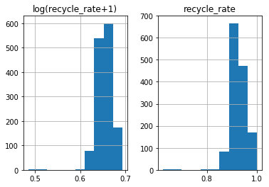
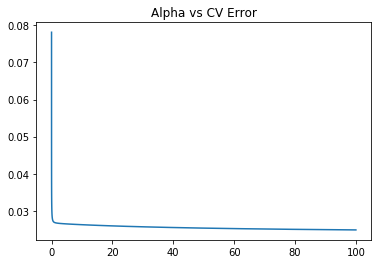
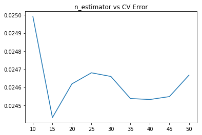
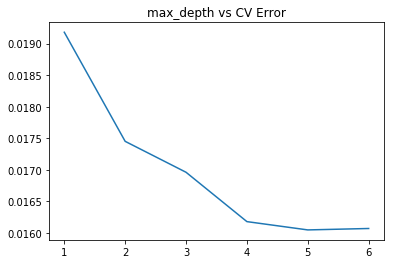

```python
import pandas as pd
import numpy as np
import re
import datetime
import Pre_Calculate
pd.set_option('display.max_columns', None)
pd.set_option('max_colwidth',100)
```

# 数据导入


```python
data_train = pd.read_csv("jinnan_round1_train_20181227.csv", encoding = 'gbk')
data_test = pd.read_csv("jinnan_round1_testA_20181227.csv", encoding = 'gbk')
```

# 数据观察


```python
data_train.head()
data_train.index
```


    RangeIndex(start=0, stop=1396, step=1)


## 观察各列信息


```python
data_train.describe()
```


<div>
<style scoped>
    .dataframe tbody tr th:only-of-type {
        vertical-align: middle;
    }

    .dataframe tbody tr th {
        vertical-align: top;
    }

    .dataframe thead th {
        text-align: right;
    }
</style>
<table border="1" class="dataframe">
  <thead>
    <tr style="text-align: right;">
      <th></th>
      <th>A1</th>
      <th>A2</th>
      <th>A3</th>
      <th>A4</th>
      <th>A6</th>
      <th>A8</th>
      <th>A10</th>
      <th>A12</th>
      <th>A13</th>
      <th>A15</th>
      <th>A17</th>
      <th>A18</th>
      <th>A19</th>
      <th>A21</th>
      <th>A22</th>
      <th>A23</th>
      <th>A27</th>
      <th>B1</th>
      <th>B2</th>
      <th>B3</th>
      <th>B6</th>
      <th>B8</th>
      <th>B12</th>
      <th>B13</th>
      <th>B14</th>
      <th>收率</th>
    </tr>
  </thead>
  <tbody>
    <tr>
      <th>count</th>
      <td>1396.000000</td>
      <td>42.0</td>
      <td>1354.000000</td>
      <td>1396.000000</td>
      <td>1396.000000</td>
      <td>149.000000</td>
      <td>1396.000000</td>
      <td>1396.000000</td>
      <td>1396.000000</td>
      <td>1396.000000</td>
      <td>1396.000000</td>
      <td>1396.000000</td>
      <td>1396.000000</td>
      <td>1393.000000</td>
      <td>1396.000000</td>
      <td>1393.000000</td>
      <td>1396.000000</td>
      <td>1386.000000</td>
      <td>1394.000000</td>
      <td>1394.000000</td>
      <td>1396.000000</td>
      <td>1395.000000</td>
      <td>1395.000000</td>
      <td>1395.000000</td>
      <td>1396.000000</td>
      <td>1396.000000</td>
    </tr>
    <tr>
      <th>mean</th>
      <td>298.853868</td>
      <td>125.0</td>
      <td>403.515510</td>
      <td>705.974212</td>
      <td>28.287751</td>
      <td>78.818792</td>
      <td>100.861032</td>
      <td>102.641834</td>
      <td>0.199907</td>
      <td>103.829370</td>
      <td>104.766905</td>
      <td>0.199928</td>
      <td>231.067335</td>
      <td>48.707825</td>
      <td>9.117120</td>
      <td>5.002872</td>
      <td>74.396848</td>
      <td>334.452742</td>
      <td>3.454412</td>
      <td>3.500072</td>
      <td>72.065186</td>
      <td>43.709677</td>
      <td>1020.215054</td>
      <td>0.149419</td>
      <td>410.403295</td>
      <td>0.923244</td>
    </tr>
    <tr>
      <th>std</th>
      <td>10.130552</td>
      <td>0.0</td>
      <td>13.348093</td>
      <td>53.214754</td>
      <td>6.742765</td>
      <td>2.683920</td>
      <td>0.905198</td>
      <td>0.915387</td>
      <td>0.002524</td>
      <td>0.963639</td>
      <td>1.401446</td>
      <td>0.002676</td>
      <td>50.478071</td>
      <td>4.976531</td>
      <td>0.369152</td>
      <td>0.136638</td>
      <td>3.044490</td>
      <td>105.120753</td>
      <td>0.388585</td>
      <td>0.002678</td>
      <td>9.161986</td>
      <td>4.338396</td>
      <td>205.920155</td>
      <td>0.008213</td>
      <td>26.018410</td>
      <td>0.030880</td>
    </tr>
    <tr>
      <th>min</th>
      <td>200.000000</td>
      <td>125.0</td>
      <td>270.000000</td>
      <td>470.000000</td>
      <td>17.000000</td>
      <td>70.000000</td>
      <td>100.000000</td>
      <td>98.000000</td>
      <td>0.120000</td>
      <td>100.000000</td>
      <td>89.000000</td>
      <td>0.100000</td>
      <td>100.000000</td>
      <td>20.000000</td>
      <td>3.500000</td>
      <td>4.000000</td>
      <td>45.000000</td>
      <td>3.500000</td>
      <td>0.150000</td>
      <td>3.500000</td>
      <td>40.000000</td>
      <td>20.000000</td>
      <td>400.000000</td>
      <td>0.030000</td>
      <td>40.000000</td>
      <td>0.624000</td>
    </tr>
    <tr>
      <th>25%</th>
      <td>300.000000</td>
      <td>125.0</td>
      <td>405.000000</td>
      <td>700.000000</td>
      <td>24.000000</td>
      <td>80.000000</td>
      <td>100.000000</td>
      <td>102.000000</td>
      <td>0.200000</td>
      <td>103.000000</td>
      <td>104.000000</td>
      <td>0.200000</td>
      <td>200.000000</td>
      <td>50.000000</td>
      <td>9.000000</td>
      <td>5.000000</td>
      <td>73.000000</td>
      <td>320.000000</td>
      <td>3.500000</td>
      <td>3.500000</td>
      <td>65.000000</td>
      <td>45.000000</td>
      <td>800.000000</td>
      <td>0.150000</td>
      <td>400.000000</td>
      <td>0.902000</td>
    </tr>
    <tr>
      <th>50%</th>
      <td>300.000000</td>
      <td>125.0</td>
      <td>405.000000</td>
      <td>700.000000</td>
      <td>29.000000</td>
      <td>80.000000</td>
      <td>101.000000</td>
      <td>103.000000</td>
      <td>0.200000</td>
      <td>104.000000</td>
      <td>105.000000</td>
      <td>0.200000</td>
      <td>200.000000</td>
      <td>50.000000</td>
      <td>9.000000</td>
      <td>5.000000</td>
      <td>73.000000</td>
      <td>320.000000</td>
      <td>3.500000</td>
      <td>3.500000</td>
      <td>78.000000</td>
      <td>45.000000</td>
      <td>1200.000000</td>
      <td>0.150000</td>
      <td>400.000000</td>
      <td>0.925000</td>
    </tr>
    <tr>
      <th>75%</th>
      <td>300.000000</td>
      <td>125.0</td>
      <td>405.000000</td>
      <td>700.000000</td>
      <td>30.000000</td>
      <td>80.000000</td>
      <td>102.000000</td>
      <td>103.000000</td>
      <td>0.200000</td>
      <td>104.000000</td>
      <td>105.000000</td>
      <td>0.200000</td>
      <td>300.000000</td>
      <td>50.000000</td>
      <td>9.000000</td>
      <td>5.000000</td>
      <td>77.000000</td>
      <td>330.000000</td>
      <td>3.500000</td>
      <td>3.500000</td>
      <td>80.000000</td>
      <td>45.000000</td>
      <td>1200.000000</td>
      <td>0.150000</td>
      <td>420.000000</td>
      <td>0.943000</td>
    </tr>
    <tr>
      <th>max</th>
      <td>300.000000</td>
      <td>125.0</td>
      <td>405.000000</td>
      <td>980.000000</td>
      <td>97.000000</td>
      <td>82.000000</td>
      <td>103.000000</td>
      <td>107.000000</td>
      <td>0.200000</td>
      <td>109.000000</td>
      <td>108.000000</td>
      <td>0.200000</td>
      <td>350.000000</td>
      <td>90.000000</td>
      <td>10.000000</td>
      <td>10.000000</td>
      <td>80.000000</td>
      <td>1200.000000</td>
      <td>3.600000</td>
      <td>3.600000</td>
      <td>80.000000</td>
      <td>73.000000</td>
      <td>1200.000000</td>
      <td>0.150000</td>
      <td>460.000000</td>
      <td>1.000800</td>
    </tr>
  </tbody>
</table>
</div>


- A2除了NaN都是125，无意义，可丢弃
- A11，A24，A26，B5，B7时间是否有意义？
- A20，A28，B4，B9，B10，B11时间段，是否用时间差？
- A25 '####'是什么意思

## 观察收率


```python
%matplotlib inline
recycle_rates = pd.DataFrame({"recycle_rate":data_train["收率"], "log(recycle_rate+1)":np.log1p(data_train["收率"])})
```


```python
recycle_rates.hist()
```


    array([[<matplotlib.axes._subplots.AxesSubplot object at 0x000001BF00C1BD30>,
            <matplotlib.axes._subplots.AxesSubplot object at 0x000001BF00D372B0>]],
          dtype=object)





没太大区别，似乎不用取对数


```python
y_train = data_train.pop('收率')
data_train.index
```


    RangeIndex(start=0, stop=1396, step=1)


```python
y_train.head()
```


    0    0.879
    1    0.902
    2    0.936
    3    0.902
    4    0.983
    Name: 收率, dtype: float64


## 观察缺失值

统计各列缺失率


```python
data_train.isnull().sum() / data_train.shape[0]
```


    样本id    0.000000
    A1      0.000000
    A2      0.969914
    A3      0.030086
    A4      0.000000
    A5      0.000000
    A6      0.000000
    A7      0.893266
    A8      0.893266
    A9      0.000000
    A10     0.000000
    A11     0.000000
    A12     0.000000
    A13     0.000000
    A14     0.000000
    A15     0.000000
    A16     0.000000
    A17     0.000000
    A18     0.000000
    A19     0.000000
    A20     0.000000
    A21     0.002149
    A22     0.000000
    A23     0.002149
    A24     0.000716
    A25     0.000000
    A26     0.001433
    A27     0.000000
    A28     0.000000
    B1      0.007163
    B2      0.001433
    B3      0.001433
    B4      0.000000
    B5      0.000716
    B6      0.000000
    B7      0.000000
    B8      0.000716
    B9      0.000000
    B10     0.174785
    B11     0.608166
    B12     0.000716
    B13     0.000716
    B14     0.000000
    dtype: float64


# 数据清洗

合并训练测试数据进行数据清洗

## A2，A7，A8缺失率过大，丢弃(合格训练集和测试集，对数据一起处理)


```python
data_all = pd.concat((data_train, data_test), axis=0, sort=False,ignore_index=True) #sort=False不改变原先列顺序
#data_all = data_all.reset_index(drop=True)
samples = data_all.pop('样本id')
```


```python
print(data_train.shape)
print(data_all.shape)
```

    (1396, 43)
    (1546, 42)
    

## 丢弃A2，A7，A8


```python
data_all.drop(columns = ['A2', 'A7', 'A8'], inplace=True)
```

## 编码单独时间列


```python
data_all = pd.concat((data_all,Pre_Calculate.Time_Code(data_all['A5'], 'A5')), axis=1)
data_all.pop('A5')
data_all = pd.concat((data_all,Pre_Calculate.Time_Code(data_all['A9'], 'A9')), axis=1)
data_all.pop('A9')
data_all = pd.concat((data_all,Pre_Calculate.Time_Code(data_all['A11'], 'A11')), axis=1)
data_all.pop('A11')
data_all = pd.concat((data_all,Pre_Calculate.Time_Code(data_all['A14'], 'A14')), axis=1)
data_all.pop('A14')
data_all = pd.concat((data_all,Pre_Calculate.Time_Code(data_all['A16'], 'A16')), axis=1)
data_all.pop('A16')
data_all = pd.concat((data_all,Pre_Calculate.Time_Code(data_all['A24'], 'A24')), axis=1)
data_all.pop('A24')
data_all = pd.concat((data_all,Pre_Calculate.Time_Code(data_all['A26'], 'A26')), axis=1)
data_all.pop('A26')
data_all = pd.concat((data_all,Pre_Calculate.Time_Code(data_all['B5'], 'B5')), axis=1)
data_all.pop('B5')
data_all = pd.concat((data_all,Pre_Calculate.Time_Code(data_all['B7'], 'B7')), axis=1)
data_all.pop('B7')
```


    0       11:30:00
    1        6:00:00
    2        1:00:00
    3       18:00:00
    4        9:00:00
    5        3:00:00
    6       19:00:00
    7       17:00:00
    8        6:30:00
    9        2:00:00
    10       1:00:00
    11      21:00:00
    12       4:00:00
    13      17:00:00
    14      17:00:00
    15      13:00:00
    16      17:00:00
    17      21:00:00
    18       1:00:00
    19       1:00:00
    20      15:30:00
    21      17:00:00
    22       1:00:00
    23      21:00:00
    24       8:00:00
    25       9:00:00
    26      17:00:00
    27      19:30:00
    28       4:00:00
    29      22:00:00
              ...   
    1516     7:30:00
    1517     6:00:00
    1518    15:30:00
    1519     9:00:00
    1520    17:00:00
    1521     9:00:00
    1522     1:00:00
    1523    17:00:00
    1524    17:00:00
    1525    22:00:00
    1526     8:00:00
    1527     1:00:00
    1528    17:00:00
    1529    12:00:00
    1530     9:00:00
    1531    22:00:00
    1532    13:00:00
    1533    17:00:00
    1534    22:00:00
    1535    20:30:00
    1536     1:00:00
    1537     8:00:00
    1538     5:00:00
    1539    13:20:00
    1540    21:00:00
    1541    10:30:00
    1542     8:00:00
    1543     4:30:00
    1544    17:00:00
    1545    14:00:00
    Name: B7, Length: 1546, dtype: object


```python
a = Pre_Calculate.Semicolon_Replace(data_all['A20'])
Pre_Calculate.Duration(a)
data_all['A20'] = a
a = Pre_Calculate.Semicolon_Replace(data_all['A28'])
Pre_Calculate.Duration(a)
data_all['A28'] = a
a = Pre_Calculate.Semicolon_Replace(data_all['B4'])
Pre_Calculate.Duration(a)
data_all['B4'] = a
a = Pre_Calculate.Semicolon_Replace(data_all['B9'])
Pre_Calculate.Duration(a)
data_all['B9'] = a
a = Pre_Calculate.Semicolon_Replace(data_all['B10'])
Pre_Calculate.Duration(a)
data_all['B10'] = a
a = Pre_Calculate.Semicolon_Replace(data_all['B11'])
Pre_Calculate.Duration(a)
data_all['B11'] = a
```

## 处理A25"######"，用均值填充


```python
data_all['A25'] = pd.to_numeric(data_all['A25'], errors='coerce') #先用NaN填充
data_all['A25'].fillna(data_all['A25'].mean())
```


    0       75.0
    1       80.0
    2       79.0
    3       70.0
    4       80.0
    5       70.0
    6       80.0
    7       78.0
    8       70.0
    9       70.0
    10      78.0
    11      75.0
    12      70.0
    13      78.0
    14      80.0
    15      70.0
    16      80.0
    17      80.0
    18      80.0
    19      78.0
    20      80.0
    21      80.0
    22      80.0
    23      70.0
    24      70.0
    25      80.0
    26      80.0
    27      90.0
    28      70.0
    29      70.0
            ... 
    1516    70.0
    1517    70.0
    1518    70.0
    1519    78.0
    1520    80.0
    1521    80.0
    1522    78.0
    1523    80.0
    1524    79.0
    1525    70.0
    1526    80.0
    1527    79.0
    1528    80.0
    1529    70.0
    1530    80.0
    1531    70.0
    1532    70.0
    1533    80.0
    1534    70.0
    1535    70.0
    1536    80.0
    1537    80.0
    1538    78.0
    1539    70.0
    1540    70.0
    1541    70.0
    1542    80.0
    1543    70.0
    1544    70.0
    1545    70.0
    Name: A25, Length: 1546, dtype: float64


## 空缺值用均值填充


```python
mean_cols = data_all.mean()
data_all.fillna(mean_cols, inplace=True)
```


```python
data_all.isnull().sum().sum()
```


    0


## 标准化数据


```python
numeric_cols = data_all.columns[data_all.dtypes != 'object']
numeric_cols
```


    Index(['A1', 'A3', 'A4', 'A6', 'A10', 'A12', 'A13', 'A15', 'A17', 'A18',
           ...
           'B7_14', 'B7_15', 'B7_16', 'B7_17', 'B7_18', 'B7_19', 'B7_20', 'B7_21',
           'B7_22', 'B7_23'],
          dtype='object', length=255)


```python
numeric_col_means = data_all.loc[:, numeric_cols].mean()
numeric_col_std = data_all.loc[:, numeric_cols].std()
data_all.loc[:, numeric_cols] = (data_all.loc[:, numeric_cols] - numeric_col_means) / numeric_col_std
```

# 建立模型

## 将训练集测试集数据分离


```python
data_train_df = data_all.loc[:len(data_train)-1]
data_test_df = data_all.loc[len(data_train):]
```


```python
data_train_df.shape, data_test_df.shape
```


    ((1396, 255), (150, 255))


## 方法一：岭回归


```python
from sklearn.linear_model import Ridge
from sklearn.model_selection import cross_val_score
```

### 将数据转化为易于处理的array格式


```python
X_train = data_train_df.values
X_test = data_test_df.values
```

### 遍历寻求最优超参数alpha


```python
alphas = np.logspace(-3, 2, 50)
test_scores = []
for alpha in alphas:
    clf = Ridge(alpha)
    test_score = np.sqrt(-cross_val_score(clf, X_train, y_train, cv=10, scoring='neg_mean_squared_error'))
    test_scores.append(np.mean(test_score))
```


```python
import matplotlib.pyplot as plt
%matplotlib inline
plt.plot(alphas, test_scores)
plt.title("Alpha vs CV Error");
print(np.argmin(test_scores))
print(alphas[49])
```

    49
    100.0
    





## 方法二：带Bagging的岭回归


```python
from sklearn.ensemble import BaggingRegressor
ridge = Ridge(100)
```

### 遍历寻找最优参数


```python
params = [1, 10, 15, 20, 25, 30, 40]
test_scores = []
for param in params:
    clf = BaggingRegressor(n_estimators=param, base_estimator=ridge)
    test_score = np.sqrt(-cross_val_score(clf, X_train, y_train, cv=10, scoring='neg_mean_squared_error'))
    test_scores.append(np.mean(test_score))
```


```python
import matplotlib.pyplot as plt
%matplotlib inline
plt.plot(params, test_scores)
plt.title("n_estimator vs CV Error");
```


## 方法三：带AdaBoost的岭回归


```python
from sklearn.ensemble import AdaBoostRegressor
```

### 遍历寻找最优参数


```python
params = [10, 15, 20, 25, 30, 35, 40, 45, 50]
test_scores = []
for param in params:
    clf = BaggingRegressor(n_estimators=param, base_estimator=ridge)
    test_score = np.sqrt(-cross_val_score(clf, X_train, y_train, cv=10, scoring='neg_mean_squared_error'))
    test_scores.append(np.mean(test_score))
```


```python
plt.plot(params, test_scores)
plt.title("n_estimator vs CV Error");
print(min(test_scores))
```

    0.024432200105194403
    





### 开始训练模型和预测数据


```python
clf = BaggingRegressor(n_estimators=15, base_estimator=ridge)
clf.fit(X_train, y_train)
Result1 = clf.predict(X_test)
```


```python
Y_test1 = pd.DataFrame(data={'样本Id':samples[data_test_df.index], '收率':Result1})
# Y_test1.to_csv("Result_1.csv", index=False, header=False)
```

## 方法四：XGBoost


```python
from xgboost import XGBRegressor
```

### 遍历寻找最优参数


```python
params = [1,2,3,4,5,6]
test_scores = []
for param in params:
    clf = XGBRegressor(max_depth=param)
    test_score = np.sqrt(-cross_val_score(clf, X_train, y_train, cv=10, scoring='neg_mean_squared_error'))
    test_scores.append(np.mean(test_score))
```


```python
import matplotlib.pyplot as plt
%matplotlib inline
plt.plot(params, test_scores)
plt.title("max_depth vs CV Error")
```


    Text(0.5,1,'max_depth vs CV Error')





```python
min(test_scores)
```


    0.016050156781475037


### 开始训练模型和预测数据


```python
clf = XGBRegressor(max_depth=5)
clf.fit(X_train, y_train)
Result3 = clf.predict(X_test)
```


```python
Y_test3 = pd.DataFrame(data={'样本Id':samples[data_test_df.index], '收率':Result3})
#Y_test3.to_csv("Result_3.csv", index=False, header=False)
```
