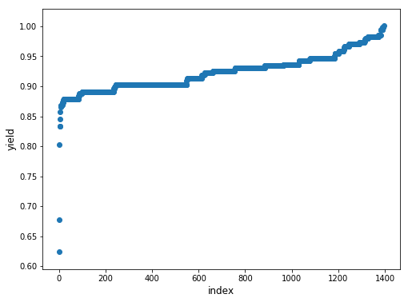
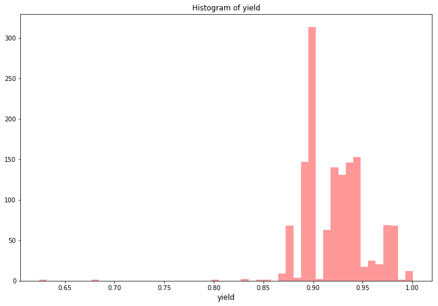

```python
import numpy as np 
import pandas as pd 
import lightgbm as lgb
import xgboost as xgb
from sklearn.linear_model import BayesianRidge
from sklearn.model_selection import KFold, RepeatedKFold
from sklearn.preprocessing import OneHotEncoder, LabelEncoder
from scipy import sparse
import warnings
import time
import sys
import os
import re
import datetime
import matplotlib.pyplot as plt
import seaborn as sns
import plotly.offline as py
py.init_notebook_mode(connected=True)
import plotly.graph_objs as go
import plotly.tools as tls
from sklearn.metrics import mean_squared_error
from sklearn.metrics import log_loss
warnings.simplefilter(action='ignore', category=FutureWarning)
warnings.filterwarnings("ignore")
pd.set_option('display.max_columns',None)
pd.set_option('max_colwidth',100)
```


<script type="text/javascript">window.PlotlyConfig = {MathJaxConfig: 'local'};</script><script type="text/javascript">if (window.MathJax) {MathJax.Hub.Config({SVG: {font: "STIX-Web"}});}</script><script>requirejs.config({paths: { 'plotly': ['https://cdn.plot.ly/plotly-latest.min']},});if(!window._Plotly) {require(['plotly'],function(plotly) {window._Plotly=plotly;});}</script>


```python
train = pd.read_csv('jinnan_round1_train_20181227.csv', encoding = 'gb18030')
test  = pd.read_csv('jinnan_round1_testA_20181227.csv', encoding = 'gb18030')
```

# 数据分析

## 基本数据分析


```python
stats = []
for col in train.columns:
    stats.append((col, train[col].nunique(), train[col].isnull().sum() * 100 / train.shape[0], train[col].value_counts(normalize=True, dropna=False).values[0] * 100, train[col].dtype))
stats_df = pd.DataFrame(stats, columns=['Feature', 'Unique_values', 'Percentage of missing values', 'Percentage of values in the biggest category', 'type'])
stats_df.sort_values('Percentage of missing values', ascending=False)[:10]
```


<div>
<style scoped>
    .dataframe tbody tr th:only-of-type {
        vertical-align: middle;
    }

    .dataframe tbody tr th {
        vertical-align: top;
    }

    .dataframe thead th {
        text-align: right;
    }
</style>
<table border="1" class="dataframe">
  <thead>
    <tr style="text-align: right;">
      <th></th>
      <th>Feature</th>
      <th>Unique_values</th>
      <th>Percentage of missing values</th>
      <th>Percentage of values in the biggest category</th>
      <th>type</th>
    </tr>
  </thead>
  <tbody>
    <tr>
      <th>2</th>
      <td>A2</td>
      <td>1</td>
      <td>96.991404</td>
      <td>96.991404</td>
      <td>float64</td>
    </tr>
    <tr>
      <th>7</th>
      <td>A7</td>
      <td>75</td>
      <td>89.326648</td>
      <td>89.326648</td>
      <td>object</td>
    </tr>
    <tr>
      <th>8</th>
      <td>A8</td>
      <td>8</td>
      <td>89.326648</td>
      <td>89.326648</td>
      <td>float64</td>
    </tr>
    <tr>
      <th>39</th>
      <td>B11</td>
      <td>37</td>
      <td>60.816619</td>
      <td>60.816619</td>
      <td>object</td>
    </tr>
    <tr>
      <th>38</th>
      <td>B10</td>
      <td>180</td>
      <td>17.478510</td>
      <td>17.478510</td>
      <td>object</td>
    </tr>
    <tr>
      <th>3</th>
      <td>A3</td>
      <td>3</td>
      <td>3.008596</td>
      <td>95.702006</td>
      <td>float64</td>
    </tr>
    <tr>
      <th>29</th>
      <td>B1</td>
      <td>21</td>
      <td>0.716332</td>
      <td>53.796562</td>
      <td>float64</td>
    </tr>
    <tr>
      <th>23</th>
      <td>A23</td>
      <td>3</td>
      <td>0.214900</td>
      <td>99.641834</td>
      <td>float64</td>
    </tr>
    <tr>
      <th>21</th>
      <td>A21</td>
      <td>12</td>
      <td>0.214900</td>
      <td>89.828080</td>
      <td>float64</td>
    </tr>
    <tr>
      <th>30</th>
      <td>B2</td>
      <td>3</td>
      <td>0.143266</td>
      <td>98.424069</td>
      <td>float64</td>
    </tr>
  </tbody>
</table>
</div>


## 收率


```python
target_col = "收率"

plt.figure(figsize=(8,6))
plt.scatter(range(train.shape[0]), np.sort(train[target_col].values))
plt.xlabel('index', fontsize=12)
plt.ylabel('yield', fontsize=12)
plt.show()
```





```python
plt.figure(figsize=(12,8))
sns.distplot(train[target_col].values, bins=50, kde=False, color="red")
plt.title("Histogram of yield")
plt.xlabel('yield', fontsize=12)
plt.show()
```





# 特征工程

删除最大类别超过90%或缺失率超过90%的列：


```python
good_cols = list(train.columns)
for col in train.columns:
    rate_biggest_catagory = train[col].value_counts(normalize=True, dropna=False).values[0]
    rate_null = train[col].isnull().sum() / train.shape[0]
    if rate_biggest_catagory > 0.9 or rate_null > 0.9:
        good_cols.remove(col)
```

去除收率异常的行：


```python
train = train[train['收率']>0.87]
```

形成处理后的train和test:


```python
train = train[good_cols]
good_cols.remove('收率')
test = test[good_cols]
```

合并train和test:


```python
target = train['收率']
del train['收率']
data = pd.concat([train, test], axis=0, ignore_index=True)
```

处理时间：
- 将单独时间变为数字
- 时间-时间变为时间段


```python
#将单独时间变为数字
def timeToNum(t):
    try:
        h, m, s = t.split(':')
    except:
        if t=='1900/1/9 7:00':
            return 7
        elif t=='1900/1/1 2:30':
            return (2 * 60 + 30) / 60
        else:
            return np.NaN
        
    try:
        tm = (int(h) * 3600 + int(m) * 60 + int(s)) / 3600
    except:
        return np.NaN
    
    return tm   

#将时间-时间变为时间段
def timeToDuration(start_end):
    try:
        start_h, start_m, end_h, end_m = re.findall(r"\d+\.?\d*", start_end)
    except:
        if start_end == np.NaN:
            return np.NaN
    
    try:
        if int(start_h) > int(end_h):  #跨了一天
            td = (int(end_h) * 3600 + int(end_m) * 60 - int(start_h) * 3600 - int(start_m) * 60) / 3600 + 24
        else:
            td = (int(end_h) * 3600 + int(end_m) * 60 - int(start_h) * 3600 - int(start_m) * 60) / 3600
    except:
        if start_end == '19:-20:05':
            return 1
        elif start_end == '15:00-1600':
            return 1
        else:
            return np.NaN
        
    return td
```


```python
for f in ['A5', 'A7', 'A9', 'A11', 'A14', 'A16', 'A24', 'A26', 'B5', 'B7']:
    data[f] = data[f].apply(timeToNum)
```


```python
for f in ['A20', 'A28', 'B4', 'B9', 'B10', 'B11']:
    data[f] = data.apply(lambda df: timeToDuration(df[f]), axis=1)
```


```python
data.head()
```


<div>
<style scoped>
    .dataframe tbody tr th:only-of-type {
        vertical-align: middle;
    }

    .dataframe tbody tr th {
        vertical-align: top;
    }

    .dataframe thead th {
        text-align: right;
    }
</style>
<table border="1" class="dataframe">
  <thead>
    <tr style="text-align: right;">
      <th></th>
      <th>样本id</th>
      <th>A5</th>
      <th>A6</th>
      <th>A7</th>
      <th>A8</th>
      <th>A9</th>
      <th>A10</th>
      <th>A11</th>
      <th>A12</th>
      <th>A14</th>
      <th>A15</th>
      <th>A16</th>
      <th>A17</th>
      <th>A19</th>
      <th>A20</th>
      <th>A21</th>
      <th>A22</th>
      <th>A24</th>
      <th>A25</th>
      <th>A26</th>
      <th>A27</th>
      <th>A28</th>
      <th>B1</th>
      <th>B4</th>
      <th>B5</th>
      <th>B6</th>
      <th>B7</th>
      <th>B8</th>
      <th>B9</th>
      <th>B10</th>
      <th>B11</th>
      <th>B12</th>
      <th>B14</th>
    </tr>
  </thead>
  <tbody>
    <tr>
      <th>0</th>
      <td>sample_1528</td>
      <td>13.5</td>
      <td>38.0</td>
      <td>NaN</td>
      <td>NaN</td>
      <td>15.5</td>
      <td>100</td>
      <td>16.5</td>
      <td>102.0</td>
      <td>17.5</td>
      <td>103.0</td>
      <td>18.5</td>
      <td>104.0</td>
      <td>300</td>
      <td>0.5</td>
      <td>50.0</td>
      <td>9.0</td>
      <td>22.0</td>
      <td>75</td>
      <td>22.5</td>
      <td>70.0</td>
      <td>0.5</td>
      <td>350.0</td>
      <td>1.0</td>
      <td>8.0</td>
      <td>65</td>
      <td>11.5</td>
      <td>45.0</td>
      <td>1.5</td>
      <td>1.5</td>
      <td>NaN</td>
      <td>800.0</td>
      <td>400</td>
    </tr>
    <tr>
      <th>1</th>
      <td>sample_1698</td>
      <td>14.0</td>
      <td>29.0</td>
      <td>NaN</td>
      <td>NaN</td>
      <td>16.0</td>
      <td>101</td>
      <td>17.0</td>
      <td>103.0</td>
      <td>18.0</td>
      <td>104.0</td>
      <td>19.0</td>
      <td>105.0</td>
      <td>200</td>
      <td>1.0</td>
      <td>50.0</td>
      <td>9.0</td>
      <td>20.0</td>
      <td>80</td>
      <td>21.0</td>
      <td>73.0</td>
      <td>1.0</td>
      <td>320.0</td>
      <td>1.0</td>
      <td>23.0</td>
      <td>80</td>
      <td>6.0</td>
      <td>45.0</td>
      <td>1.5</td>
      <td>1.5</td>
      <td>1.0</td>
      <td>1200.0</td>
      <td>400</td>
    </tr>
    <tr>
      <th>2</th>
      <td>sample_639</td>
      <td>14.0</td>
      <td>29.0</td>
      <td>NaN</td>
      <td>NaN</td>
      <td>16.0</td>
      <td>102</td>
      <td>17.0</td>
      <td>103.0</td>
      <td>18.0</td>
      <td>104.0</td>
      <td>19.0</td>
      <td>105.0</td>
      <td>200</td>
      <td>0.5</td>
      <td>50.0</td>
      <td>9.0</td>
      <td>20.0</td>
      <td>79</td>
      <td>21.0</td>
      <td>73.0</td>
      <td>1.0</td>
      <td>320.0</td>
      <td>1.0</td>
      <td>23.0</td>
      <td>80</td>
      <td>1.0</td>
      <td>45.0</td>
      <td>1.5</td>
      <td>1.5</td>
      <td>1.0</td>
      <td>1200.0</td>
      <td>400</td>
    </tr>
    <tr>
      <th>3</th>
      <td>sample_483</td>
      <td>1.5</td>
      <td>38.0</td>
      <td>NaN</td>
      <td>NaN</td>
      <td>3.0</td>
      <td>100</td>
      <td>4.0</td>
      <td>102.0</td>
      <td>5.0</td>
      <td>103.0</td>
      <td>6.0</td>
      <td>104.0</td>
      <td>200</td>
      <td>0.5</td>
      <td>50.0</td>
      <td>10.0</td>
      <td>7.5</td>
      <td>70</td>
      <td>8.0</td>
      <td>78.0</td>
      <td>1.0</td>
      <td>290.0</td>
      <td>1.0</td>
      <td>15.5</td>
      <td>65</td>
      <td>18.0</td>
      <td>45.0</td>
      <td>1.5</td>
      <td>1.5</td>
      <td>NaN</td>
      <td>800.0</td>
      <td>400</td>
    </tr>
    <tr>
      <th>4</th>
      <td>sample_617</td>
      <td>22.0</td>
      <td>29.0</td>
      <td>NaN</td>
      <td>NaN</td>
      <td>0.0</td>
      <td>101</td>
      <td>1.0</td>
      <td>103.0</td>
      <td>2.0</td>
      <td>104.0</td>
      <td>3.0</td>
      <td>105.0</td>
      <td>200</td>
      <td>1.0</td>
      <td>50.0</td>
      <td>9.0</td>
      <td>4.0</td>
      <td>80</td>
      <td>5.0</td>
      <td>73.0</td>
      <td>1.0</td>
      <td>320.0</td>
      <td>1.0</td>
      <td>7.0</td>
      <td>80</td>
      <td>9.0</td>
      <td>45.0</td>
      <td>1.5</td>
      <td>1.5</td>
      <td>1.0</td>
      <td>1200.0</td>
      <td>420</td>
    </tr>
  </tbody>
</table>
</div>


去除“样本id”列：


```python
cate_columns = [f for f in data.columns if f != '样本id']
```

对每个特征编码（不同类对应不同码），并分离训练测试集：


```python
for f in cate_columns:
    data[f] = data[f].map(dict(zip(data[f].unique(), range(0, data[f].nunique()))))
train = data[:train.shape[0]]
test  = data[train.shape[0]:]
```

对收率进行分箱，并求出不同箱的每个特征的均值：


```python
train['target'] = target

train['intTarget'] = pd.cut(train['target'], 5, labels=False)

train = pd.get_dummies(train, columns=['intTarget'])

li = ['intTarget_0.0','intTarget_1.0','intTarget_2.0','intTarget_3.0','intTarget_4.0']
mean_features = []

for f1 in cate_columns:
    for f2 in li:
        col_name = f1+"_"+f2+'_mean'
        mean_features.append(col_name)
        order_label = train.groupby([f1])[f2].mean()
        for df in [train, test]:
            df[col_name] = df[f].map(order_label) #？？？？？？？？？？

train.drop(li, axis=1, inplace=True)
```


```python
train.drop(['样本id', 'target'], axis=1, inplace=True)
samples_id = test.pop('样本id')
test = test[train.columns]
X_train = train.values
y_train = target.values
X_test = test.values
```

# 训练模型

## lgb


```python
param = {'num_leaves': 120,
         'min_data_in_leaf': 30, 
         'objective':'regression',
         'max_depth': -1,
         'learning_rate': 0.01,
         "min_child_samples": 30,
         "boosting": "gbdt",
         "feature_fraction": 0.9,
         "bagging_freq": 1,
         "bagging_fraction": 0.9 ,
         "bagging_seed": 11,
         "metric": 'mse',
         "lambda_l1": 0.1,
         "verbosity": -1}
folds = KFold(n_splits=5, shuffle=True, random_state=2018)
oof_lgb = np.zeros(len(train))
predictions_lgb = np.zeros(len(test))

for fold_, (trn_idx, val_idx) in enumerate(folds.split(X_train, y_train)):
    print("fold n°{}".format(fold_+1))
    trn_data = lgb.Dataset(X_train[trn_idx], y_train[trn_idx])
    val_data = lgb.Dataset(X_train[val_idx], y_train[val_idx])

    num_round = 10000
    clf = lgb.train(param, trn_data, num_round, valid_sets = [trn_data, val_data], verbose_eval=200, early_stopping_rounds = 100)
    oof_lgb[val_idx] = clf.predict(X_train[val_idx], num_iteration=clf.best_iteration)
    
    predictions_lgb += clf.predict(X_test, num_iteration=clf.best_iteration) / folds.n_splits

print("CV score: {:<8.8f}".format(mean_squared_error(oof_lgb, target)))
```

    fold n°1
    Training until validation scores don't improve for 100 rounds.
    [200]	training's l2: 0.000212137	valid_1's l2: 0.000238021
    [400]	training's l2: 0.000164335	valid_1's l2: 0.000194897
    [600]	training's l2: 0.000147888	valid_1's l2: 0.00018731
    [800]	training's l2: 0.000139047	valid_1's l2: 0.000184509
    [1000]	training's l2: 0.000133345	valid_1's l2: 0.000182779
    [1200]	training's l2: 0.000129281	valid_1's l2: 0.000181957
    [1400]	training's l2: 0.000126055	valid_1's l2: 0.00018142
    [1600]	training's l2: 0.000123626	valid_1's l2: 0.000181177
    [1800]	training's l2: 0.000121466	valid_1's l2: 0.000181074
    [2000]	training's l2: 0.000119616	valid_1's l2: 0.000180921
    Early stopping, best iteration is:
    [1925]	training's l2: 0.00012029	valid_1's l2: 0.000180812
    fold n°2
    Training until validation scores don't improve for 100 rounds.
    [200]	training's l2: 0.000212554	valid_1's l2: 0.000235927
    [400]	training's l2: 0.000163334	valid_1's l2: 0.000208733
    [600]	training's l2: 0.000146801	valid_1's l2: 0.000202414
    [800]	training's l2: 0.000137439	valid_1's l2: 0.00019966
    [1000]	training's l2: 0.000130914	valid_1's l2: 0.000198607
    [1200]	training's l2: 0.000125946	valid_1's l2: 0.000198224
    Early stopping, best iteration is:
    [1133]	training's l2: 0.000127463	valid_1's l2: 0.000198062
    fold n°3
    Training until validation scores don't improve for 100 rounds.
    [200]	training's l2: 0.00022153	valid_1's l2: 0.000272041
    [400]	training's l2: 0.000170161	valid_1's l2: 0.000216068
    [600]	training's l2: 0.000149827	valid_1's l2: 0.00020282
    [800]	training's l2: 0.000139517	valid_1's l2: 0.000198176
    [1000]	training's l2: 0.000133112	valid_1's l2: 0.000196708
    [1200]	training's l2: 0.000128524	valid_1's l2: 0.000195739
    [1400]	training's l2: 0.000125219	valid_1's l2: 0.000195323
    Early stopping, best iteration is:
    [1412]	training's l2: 0.000124977	valid_1's l2: 0.000195266
    fold n°4
    Training until validation scores don't improve for 100 rounds.
    [200]	training's l2: 0.000219621	valid_1's l2: 0.000232849
    [400]	training's l2: 0.000169737	valid_1's l2: 0.000195726
    [600]	training's l2: 0.000152974	valid_1's l2: 0.000185678
    [800]	training's l2: 0.000143718	valid_1's l2: 0.000181584
    [1000]	training's l2: 0.00013766	valid_1's l2: 0.000179672
    [1200]	training's l2: 0.000133036	valid_1's l2: 0.000178064
    [1400]	training's l2: 0.000129345	valid_1's l2: 0.000176906
    [1600]	training's l2: 0.000126458	valid_1's l2: 0.000176069
    [1800]	training's l2: 0.000124001	valid_1's l2: 0.000175731
    [2000]	training's l2: 0.000121936	valid_1's l2: 0.000175381
    [2200]	training's l2: 0.000120168	valid_1's l2: 0.000174966
    [2400]	training's l2: 0.000118598	valid_1's l2: 0.00017451
    Early stopping, best iteration is:
    [2405]	training's l2: 0.000118553	valid_1's l2: 0.000174475
    fold n°5
    Training until validation scores don't improve for 100 rounds.
    [200]	training's l2: 0.000218469	valid_1's l2: 0.000230384
    [400]	training's l2: 0.000171875	valid_1's l2: 0.000188859
    [600]	training's l2: 0.000154415	valid_1's l2: 0.0001795
    [800]	training's l2: 0.000144704	valid_1's l2: 0.00017592
    [1000]	training's l2: 0.000138358	valid_1's l2: 0.000173987
    [1200]	training's l2: 0.000133965	valid_1's l2: 0.000172636
    [1400]	training's l2: 0.00013066	valid_1's l2: 0.000171696
    [1600]	training's l2: 0.000128103	valid_1's l2: 0.000171138
    [1800]	training's l2: 0.000125957	valid_1's l2: 0.000170818
    [2000]	training's l2: 0.000123945	valid_1's l2: 0.000170245
    Early stopping, best iteration is:
    [2073]	training's l2: 0.000123321	valid_1's l2: 0.00017004
    CV score: 0.00018373
    

## xgb


```python
xgb_params = {'eta': 0.005, 'max_depth': 10, 'subsample': 0.8, 'colsample_bytree': 0.8, 
          'objective': 'reg:linear', 'eval_metric': 'rmse', 'silent': True, 'nthread': 4}

folds = KFold(n_splits=5, shuffle=True, random_state=0)
oof_xgb = np.zeros(len(train))
predictions_xgb = np.zeros(len(test))

for fold_, (trn_idx, val_idx) in enumerate(folds.split(X_train, y_train)):
    print("fold n°{}".format(fold_+1))
    trn_data = xgb.DMatrix(X_train[trn_idx], y_train[trn_idx])
    val_data = xgb.DMatrix(X_train[val_idx], y_train[val_idx])

    watchlist = [(trn_data, 'train'), (val_data, 'valid_data')]
    clf = xgb.train(dtrain=trn_data, num_boost_round=20000, evals=watchlist, early_stopping_rounds=200, verbose_eval=100, params=xgb_params)
    oof_xgb[val_idx] = clf.predict(xgb.DMatrix(X_train[val_idx]), ntree_limit=clf.best_ntree_limit)
    predictions_xgb += clf.predict(xgb.DMatrix(X_test), ntree_limit=clf.best_ntree_limit) / folds.n_splits
    
print("CV score: {:<8.8f}".format(mean_squared_error(oof_xgb, target)))
```

    fold n°1
    [0]	train-rmse:0.423745	valid_data-rmse:0.420568
    Multiple eval metrics have been passed: 'valid_data-rmse' will be used for early stopping.
    
    Will train until valid_data-rmse hasn't improved in 200 rounds.
    [100]	train-rmse:0.257478	valid_data-rmse:0.254598
    [200]	train-rmse:0.156878	valid_data-rmse:0.154248
    [300]	train-rmse:0.096081	valid_data-rmse:0.093795
    [400]	train-rmse:0.05951	valid_data-rmse:0.057734
    [500]	train-rmse:0.03767	valid_data-rmse:0.036624
    [600]	train-rmse:0.024826	valid_data-rmse:0.024933
    [700]	train-rmse:0.017359	valid_data-rmse:0.018992
    [800]	train-rmse:0.013103	valid_data-rmse:0.016287
    [900]	train-rmse:0.010696	valid_data-rmse:0.015207
    [1000]	train-rmse:0.009318	valid_data-rmse:0.014834
    [1100]	train-rmse:0.008483	valid_data-rmse:0.014742
    [1200]	train-rmse:0.007904	valid_data-rmse:0.014748
    [1300]	train-rmse:0.007496	valid_data-rmse:0.014792
    Stopping. Best iteration:
    [1110]	train-rmse:0.00841	valid_data-rmse:0.014737
    
    fold n°2
    [0]	train-rmse:0.422722	valid_data-rmse:0.424681
    Multiple eval metrics have been passed: 'valid_data-rmse' will be used for early stopping.
    
    Will train until valid_data-rmse hasn't improved in 200 rounds.
    [100]	train-rmse:0.256883	valid_data-rmse:0.259407
    [200]	train-rmse:0.156554	valid_data-rmse:0.159512
    [300]	train-rmse:0.095937	valid_data-rmse:0.098984
    [400]	train-rmse:0.059491	valid_data-rmse:0.062371
    [500]	train-rmse:0.037805	valid_data-rmse:0.040396
    [600]	train-rmse:0.025052	valid_data-rmse:0.027573
    [700]	train-rmse:0.017631	valid_data-rmse:0.020368
    [800]	train-rmse:0.013373	valid_data-rmse:0.016484
    [900]	train-rmse:0.010988	valid_data-rmse:0.014469
    [1000]	train-rmse:0.009604	valid_data-rmse:0.013456
    [1100]	train-rmse:0.008787	valid_data-rmse:0.012946
    [1200]	train-rmse:0.008256	valid_data-rmse:0.012688
    [1300]	train-rmse:0.00788	valid_data-rmse:0.012566
    [1400]	train-rmse:0.007596	valid_data-rmse:0.0125
    [1500]	train-rmse:0.007378	valid_data-rmse:0.012485
    [1600]	train-rmse:0.0072	valid_data-rmse:0.012484
    Stopping. Best iteration:
    [1468]	train-rmse:0.007444	valid_data-rmse:0.01248
    
    fold n°3
    [0]	train-rmse:0.422515	valid_data-rmse:0.425497
    Multiple eval metrics have been passed: 'valid_data-rmse' will be used for early stopping.
    
    Will train until valid_data-rmse hasn't improved in 200 rounds.
    [100]	train-rmse:0.256742	valid_data-rmse:0.259119
    [200]	train-rmse:0.156421	valid_data-rmse:0.158306
    [300]	train-rmse:0.095836	valid_data-rmse:0.097224
    [400]	train-rmse:0.059378	valid_data-rmse:0.060467
    [500]	train-rmse:0.037615	valid_data-rmse:0.038686
    [600]	train-rmse:0.024843	valid_data-rmse:0.026332
    [700]	train-rmse:0.017443	valid_data-rmse:0.019799
    [800]	train-rmse:0.013228	valid_data-rmse:0.016587
    [900]	train-rmse:0.010849	valid_data-rmse:0.015106
    [1000]	train-rmse:0.00949	valid_data-rmse:0.014467
    [1100]	train-rmse:0.008663	valid_data-rmse:0.014181
    [1200]	train-rmse:0.008112	valid_data-rmse:0.014066
    [1300]	train-rmse:0.007734	valid_data-rmse:0.014041
    [1400]	train-rmse:0.007415	valid_data-rmse:0.014073
    Stopping. Best iteration:
    [1264]	train-rmse:0.007862	valid_data-rmse:0.014031
    
    fold n°4
    [0]	train-rmse:0.423812	valid_data-rmse:0.42028
    Multiple eval metrics have been passed: 'valid_data-rmse' will be used for early stopping.
    
    Will train until valid_data-rmse hasn't improved in 200 rounds.
    [100]	train-rmse:0.257514	valid_data-rmse:0.254615
    [200]	train-rmse:0.156914	valid_data-rmse:0.154501
    [300]	train-rmse:0.096135	valid_data-rmse:0.094363
    [400]	train-rmse:0.059576	valid_data-rmse:0.058464
    [500]	train-rmse:0.037792	valid_data-rmse:0.037347
    [600]	train-rmse:0.024979	valid_data-rmse:0.025512
    [700]	train-rmse:0.017547	valid_data-rmse:0.019249
    [800]	train-rmse:0.013302	valid_data-rmse:0.016304
    [900]	train-rmse:0.0109	valid_data-rmse:0.015028
    [1000]	train-rmse:0.009509	valid_data-rmse:0.01452
    [1100]	train-rmse:0.008679	valid_data-rmse:0.014334
    [1200]	train-rmse:0.008136	valid_data-rmse:0.014302
    [1300]	train-rmse:0.00775	valid_data-rmse:0.014324
    Stopping. Best iteration:
    [1188]	train-rmse:0.008192	valid_data-rmse:0.014296
    
    fold n°5
    [0]	train-rmse:0.422761	valid_data-rmse:0.424509
    Multiple eval metrics have been passed: 'valid_data-rmse' will be used for early stopping.
    
    Will train until valid_data-rmse hasn't improved in 200 rounds.
    [100]	train-rmse:0.256879	valid_data-rmse:0.257725
    [200]	train-rmse:0.156527	valid_data-rmse:0.156765
    [300]	train-rmse:0.095931	valid_data-rmse:0.095627
    [400]	train-rmse:0.059486	valid_data-rmse:0.058928
    [500]	train-rmse:0.037745	valid_data-rmse:0.037198
    [600]	train-rmse:0.025002	valid_data-rmse:0.024817
    [700]	train-rmse:0.017605	valid_data-rmse:0.018118
    [800]	train-rmse:0.013368	valid_data-rmse:0.014828
    [900]	train-rmse:0.010956	valid_data-rmse:0.013358
    [1000]	train-rmse:0.009571	valid_data-rmse:0.012767
    [1100]	train-rmse:0.008725	valid_data-rmse:0.012563
    [1200]	train-rmse:0.008162	valid_data-rmse:0.0125
    [1300]	train-rmse:0.007736	valid_data-rmse:0.012496
    [1400]	train-rmse:0.007418	valid_data-rmse:0.012522
    Stopping. Best iteration:
    [1276]	train-rmse:0.007826	valid_data-rmse:0.012488
    
    CV score: 0.00018605
    

## 将lgb和xgb的结果进行stacking


```python
train_stack = np.vstack([oof_lgb,oof_xgb]).transpose()
test_stack = np.vstack([predictions_lgb, predictions_xgb]).transpose()

folds_stack = RepeatedKFold(n_splits=5, n_repeats=2, random_state=0)
oof_stack = np.zeros(train_stack.shape[0])
predictions = np.zeros(test_stack.shape[0])

for fold_, (trn_idx, val_idx) in enumerate(folds_stack.split(train_stack,target)):
    print("fold {}".format(fold_))
    trn_data, trn_y = train_stack[trn_idx], target.iloc[trn_idx].values
    val_data, val_y = train_stack[val_idx], target.iloc[val_idx].values
    
    clf_3 = BayesianRidge()
    clf_3.fit(trn_data, trn_y)
    
    oof_stack[val_idx] = clf_3.predict(val_data)
    predictions += clf_3.predict(test_stack) / 10
    
mean_squared_error(target.values, oof_stack)
```

    fold 0
    fold 1
    fold 2
    fold 3
    fold 4
    fold 5
    fold 6
    fold 7
    fold 8
    fold 9
    


    0.00017818527698087045


# 写入文件


```python
Y_test = pd.DataFrame(data={'样本Id':samples_id, '收率':predictions})
Y_test['收率'] = Y_test['收率'].apply(lambda x: round(x, 3))
```


```python
#Y_test.to_csv("Result_5.csv", index=False, header=False)
```
