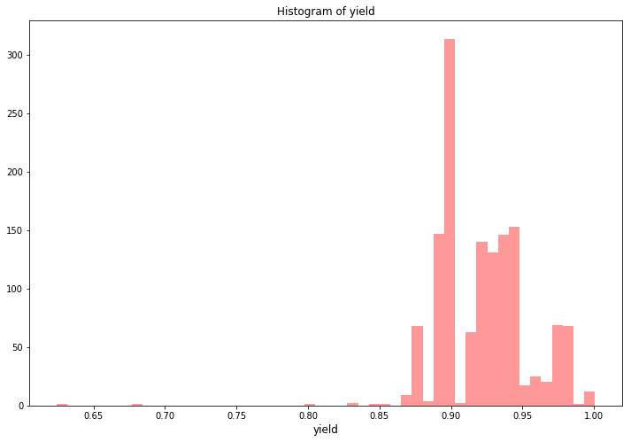

```python
import numpy as np 
import pandas as pd 
import lightgbm as lgb
import xgboost as xgb
from sklearn.linear_model import BayesianRidge
from sklearn.model_selection import KFold, RepeatedKFold
from sklearn.preprocessing import OneHotEncoder, LabelEncoder
from scipy import sparse
import warnings
import time
import sys
import os
import re
import datetime
import matplotlib.pyplot as plt
import seaborn as sns
import plotly.offline as py
py.init_notebook_mode(connected=True)
import plotly.graph_objs as go
import plotly.tools as tls
from sklearn.metrics import mean_squared_error
from sklearn.metrics import log_loss
warnings.simplefilter(action='ignore', category=FutureWarning)
warnings.filterwarnings("ignore")
pd.set_option('display.max_columns',None)
pd.set_option('max_colwidth',100)
```


<script type="text/javascript">window.PlotlyConfig = {MathJaxConfig: 'local'};</script><script type="text/javascript">if (window.MathJax) {MathJax.Hub.Config({SVG: {font: "STIX-Web"}});}</script><script>requirejs.config({paths: { 'plotly': ['https://cdn.plot.ly/plotly-latest.min']},});if(!window._Plotly) {require(['plotly'],function(plotly) {window._Plotly=plotly;});}</script>


```python
train = pd.read_csv('jinnan_round1_train_20181227.csv', encoding = 'gb18030')
test  = pd.read_csv('jinnan_round1_testA_20181227.csv', encoding = 'gb18030')
```

# 数据分析

## 基本数据分析


```python
stats = []
for col in train.columns:
    stats.append((col, train[col].nunique(), train[col].isnull().sum() * 100 / train.shape[0], train[col].value_counts(normalize=True, dropna=False).values[0] * 100, train[col].dtype))
stats_df = pd.DataFrame(stats, columns=['Feature', 'Unique_values', 'Percentage of missing values', 'Percentage of values in the biggest category', 'type'])
stats_df.sort_values('Percentage of missing values', ascending=False)[:10]
```


<div>
<style scoped>
    .dataframe tbody tr th:only-of-type {
        vertical-align: middle;
    }

    .dataframe tbody tr th {
        vertical-align: top;
    }

    .dataframe thead th {
        text-align: right;
    }
</style>
<table border="1" class="dataframe">
  <thead>
    <tr style="text-align: right;">
      <th></th>
      <th>Feature</th>
      <th>Unique_values</th>
      <th>Percentage of missing values</th>
      <th>Percentage of values in the biggest category</th>
      <th>type</th>
    </tr>
  </thead>
  <tbody>
    <tr>
      <th>2</th>
      <td>A2</td>
      <td>1</td>
      <td>96.991404</td>
      <td>96.991404</td>
      <td>float64</td>
    </tr>
    <tr>
      <th>7</th>
      <td>A7</td>
      <td>75</td>
      <td>89.326648</td>
      <td>89.326648</td>
      <td>object</td>
    </tr>
    <tr>
      <th>8</th>
      <td>A8</td>
      <td>8</td>
      <td>89.326648</td>
      <td>89.326648</td>
      <td>float64</td>
    </tr>
    <tr>
      <th>39</th>
      <td>B11</td>
      <td>37</td>
      <td>60.816619</td>
      <td>60.816619</td>
      <td>object</td>
    </tr>
    <tr>
      <th>38</th>
      <td>B10</td>
      <td>180</td>
      <td>17.478510</td>
      <td>17.478510</td>
      <td>object</td>
    </tr>
    <tr>
      <th>3</th>
      <td>A3</td>
      <td>3</td>
      <td>3.008596</td>
      <td>95.702006</td>
      <td>float64</td>
    </tr>
    <tr>
      <th>29</th>
      <td>B1</td>
      <td>21</td>
      <td>0.716332</td>
      <td>53.796562</td>
      <td>float64</td>
    </tr>
    <tr>
      <th>23</th>
      <td>A23</td>
      <td>3</td>
      <td>0.214900</td>
      <td>99.641834</td>
      <td>float64</td>
    </tr>
    <tr>
      <th>21</th>
      <td>A21</td>
      <td>12</td>
      <td>0.214900</td>
      <td>89.828080</td>
      <td>float64</td>
    </tr>
    <tr>
      <th>30</th>
      <td>B2</td>
      <td>3</td>
      <td>0.143266</td>
      <td>98.424069</td>
      <td>float64</td>
    </tr>
  </tbody>
</table>
</div>


## 收率


```python
target_col = "收率"

plt.figure(figsize=(8,6))
plt.scatter(range(train.shape[0]), np.sort(train[target_col].values))
plt.xlabel('index', fontsize=12)
plt.ylabel('yield', fontsize=12)
plt.show()
```


```python
plt.figure(figsize=(12,8))
sns.distplot(train[target_col].values, bins=50, kde=False, color="red")
plt.title("Histogram of yield")
plt.xlabel('yield', fontsize=12)
plt.show()
```





# 特征工程

删除最大类别超过90%或缺失率超过90%的列：


```python
good_cols = list(train.columns)
for col in train.columns:
    rate_biggest_catagory = train[col].value_counts(normalize=True, dropna=False).values[0]
    rate_null = train[col].isnull().sum() / train.shape[0]
    if rate_biggest_catagory > 0.9 or rate_null > 0.9:
        good_cols.remove(col)
```

去除收率异常的行：


```python
train = train[train['收率']>0.87]
```

形成处理后的train和test:


```python
train = train[good_cols]
good_cols.remove('收率')
test = test[good_cols]
```

合并train和test:


```python
recycle_rate = train['收率']
del train['收率']
data = pd.concat([train, test], axis=0, ignore_index=True)
```

处理时间：
- 将单独时间变为数字
- 时间-时间变为时间段


```python
#将单独时间变为数字
def timeToNum(t):
    try:
        h, m, s = t.split(':')
    except:
        if t=='1900/1/9 7:00':
            return 7
        elif t=='1900/1/1 2:30':
            return (2 * 60 + 30) / 60
        else:
            return np.NaN
        
    try:
        tm = (int(h) * 3600 + int(m) * 60 + int(s)) / 3600
    except:
        return np.NaN
    
    return tm   

#将时间-时间变为时间段
def timeToDuration(start_end):
    try:
        start_h, start_m, end_h, end_m = re.findall(r"\d+\.?\d*", start_end)
    except:
        if start_end == np.NaN:
            return np.NaN
    
    try:
        if int(start_h) > int(end_h):  #跨了一天
            td = (int(end_h) * 3600 + int(end_m) * 60 - int(start_h) * 3600 - int(start_m) * 60) / 3600 + 24
        else:
            td = (int(end_h) * 3600 + int(end_m) * 60 - int(start_h) * 3600 - int(start_m) * 60) / 3600
    except:
        if start_end == '19:-20:05':
            return 1
        elif start_end == '15:00-1600':
            return 1
        else:
            return np.NaN
        
    return td
```


```python
for f in ['A5', 'A7', 'A9', 'A11', 'A14', 'A16', 'A24', 'A26', 'B5', 'B7']:
    data[f] = data[f].apply(timeToNum)
```


```python
for f in ['A20', 'A28', 'B4', 'B9', 'B10', 'B11']:
    data[f] = data.apply(lambda df: timeToDuration(df[f]), axis=1)
```


```python
data.head()
```


<div>
<style scoped>
    .dataframe tbody tr th:only-of-type {
        vertical-align: middle;
    }

    .dataframe tbody tr th {
        vertical-align: top;
    }

    .dataframe thead th {
        text-align: right;
    }
</style>
<table border="1" class="dataframe">
  <thead>
    <tr style="text-align: right;">
      <th></th>
      <th>样本id</th>
      <th>A5</th>
      <th>A6</th>
      <th>A7</th>
      <th>A8</th>
      <th>A9</th>
      <th>A10</th>
      <th>A11</th>
      <th>A12</th>
      <th>A14</th>
      <th>A15</th>
      <th>A16</th>
      <th>A17</th>
      <th>A19</th>
      <th>A20</th>
      <th>A21</th>
      <th>A22</th>
      <th>A24</th>
      <th>A25</th>
      <th>A26</th>
      <th>A27</th>
      <th>A28</th>
      <th>B1</th>
      <th>B4</th>
      <th>B5</th>
      <th>B6</th>
      <th>B7</th>
      <th>B8</th>
      <th>B9</th>
      <th>B10</th>
      <th>B11</th>
      <th>B12</th>
      <th>B14</th>
    </tr>
  </thead>
  <tbody>
    <tr>
      <th>0</th>
      <td>sample_1528</td>
      <td>13.5</td>
      <td>38.0</td>
      <td>NaN</td>
      <td>NaN</td>
      <td>15.5</td>
      <td>100</td>
      <td>16.5</td>
      <td>102.0</td>
      <td>17.5</td>
      <td>103.0</td>
      <td>18.5</td>
      <td>104.0</td>
      <td>300</td>
      <td>0.5</td>
      <td>50.0</td>
      <td>9.0</td>
      <td>22.0</td>
      <td>75</td>
      <td>22.5</td>
      <td>70.0</td>
      <td>0.5</td>
      <td>350.0</td>
      <td>1.0</td>
      <td>8.0</td>
      <td>65</td>
      <td>11.5</td>
      <td>45.0</td>
      <td>1.5</td>
      <td>1.5</td>
      <td>NaN</td>
      <td>800.0</td>
      <td>400</td>
    </tr>
    <tr>
      <th>1</th>
      <td>sample_1698</td>
      <td>14.0</td>
      <td>29.0</td>
      <td>NaN</td>
      <td>NaN</td>
      <td>16.0</td>
      <td>101</td>
      <td>17.0</td>
      <td>103.0</td>
      <td>18.0</td>
      <td>104.0</td>
      <td>19.0</td>
      <td>105.0</td>
      <td>200</td>
      <td>1.0</td>
      <td>50.0</td>
      <td>9.0</td>
      <td>20.0</td>
      <td>80</td>
      <td>21.0</td>
      <td>73.0</td>
      <td>1.0</td>
      <td>320.0</td>
      <td>1.0</td>
      <td>23.0</td>
      <td>80</td>
      <td>6.0</td>
      <td>45.0</td>
      <td>1.5</td>
      <td>1.5</td>
      <td>1.0</td>
      <td>1200.0</td>
      <td>400</td>
    </tr>
    <tr>
      <th>2</th>
      <td>sample_639</td>
      <td>14.0</td>
      <td>29.0</td>
      <td>NaN</td>
      <td>NaN</td>
      <td>16.0</td>
      <td>102</td>
      <td>17.0</td>
      <td>103.0</td>
      <td>18.0</td>
      <td>104.0</td>
      <td>19.0</td>
      <td>105.0</td>
      <td>200</td>
      <td>0.5</td>
      <td>50.0</td>
      <td>9.0</td>
      <td>20.0</td>
      <td>79</td>
      <td>21.0</td>
      <td>73.0</td>
      <td>1.0</td>
      <td>320.0</td>
      <td>1.0</td>
      <td>23.0</td>
      <td>80</td>
      <td>1.0</td>
      <td>45.0</td>
      <td>1.5</td>
      <td>1.5</td>
      <td>1.0</td>
      <td>1200.0</td>
      <td>400</td>
    </tr>
    <tr>
      <th>3</th>
      <td>sample_483</td>
      <td>1.5</td>
      <td>38.0</td>
      <td>NaN</td>
      <td>NaN</td>
      <td>3.0</td>
      <td>100</td>
      <td>4.0</td>
      <td>102.0</td>
      <td>5.0</td>
      <td>103.0</td>
      <td>6.0</td>
      <td>104.0</td>
      <td>200</td>
      <td>0.5</td>
      <td>50.0</td>
      <td>10.0</td>
      <td>7.5</td>
      <td>70</td>
      <td>8.0</td>
      <td>78.0</td>
      <td>1.0</td>
      <td>290.0</td>
      <td>1.0</td>
      <td>15.5</td>
      <td>65</td>
      <td>18.0</td>
      <td>45.0</td>
      <td>1.5</td>
      <td>1.5</td>
      <td>NaN</td>
      <td>800.0</td>
      <td>400</td>
    </tr>
    <tr>
      <th>4</th>
      <td>sample_617</td>
      <td>22.0</td>
      <td>29.0</td>
      <td>NaN</td>
      <td>NaN</td>
      <td>0.0</td>
      <td>101</td>
      <td>1.0</td>
      <td>103.0</td>
      <td>2.0</td>
      <td>104.0</td>
      <td>3.0</td>
      <td>105.0</td>
      <td>200</td>
      <td>1.0</td>
      <td>50.0</td>
      <td>9.0</td>
      <td>4.0</td>
      <td>80</td>
      <td>5.0</td>
      <td>73.0</td>
      <td>1.0</td>
      <td>320.0</td>
      <td>1.0</td>
      <td>7.0</td>
      <td>80</td>
      <td>9.0</td>
      <td>45.0</td>
      <td>1.5</td>
      <td>1.5</td>
      <td>1.0</td>
      <td>1200.0</td>
      <td>420</td>
    </tr>
  </tbody>
</table>
</div>


将A25列转化为数值型，特殊字符用NaN填充：


```python
data['A25'] = pd.to_numeric(data['A25'], errors='coerce')
```

NaN用均值填充：


```python
mean_cols = data.mean()
data.fillna(mean_cols, inplace=True)
```


```python
data.isnull().sum().sum()
```


    0


分离训练测试集：


```python
train = data[:train.shape[0]]
test  = data[train.shape[0]:]
```


```python
train.shape, test.shape
```


    ((1381, 33), (150, 33))


去除'样本id'列：


```python
train.drop(['样本id'], axis=1, inplace=True)
samples_id = test.pop('样本id')
```

转化为array格式：


```python
X_train = train.values
y_train = recycle_rate.values
X_test = test.values
```

# 训练模型

## XGBoost


```python
from xgboost import XGBRegressor
from sklearn.cross_validation import cross_val_score
```

### GridSearch调参


```python
from sklearn.grid_search import GridSearchCV
```


```python
param_grid = {"max_depth":[4,5,6,7,8,9],
              "learning_rate":[0.01,0.05,0.1,0.2,0.3,0.4]}

model = XGBRegressor(objective='reg:linear', eval_metric='rmse')
grid_search = GridSearchCV(model, param_grid, cv=10, scoring='neg_mean_squared_error')
grid_search.fit(X_train, y_train)
model_1 = grid_search.best_estimator_
print("Best parameters:{}".format(grid_search.best_params_))
print("Best score on train set:{:}".format(grid_search.best_score_))
```


```python
xgb_params = {'eta': 0.1, 'max_depth': 6, 'subsample': 0.8, 'colsample_bytree': 0.8, 
          'objective': 'reg:linear', 'eval_metric': 'rmse', 'silent': True, 'nthread': 4}

folds = KFold(n_splits=5, shuffle=True, random_state=2018)
oof_xgb = np.zeros(len(X_train))
predictions_xgb = np.zeros(len(X_test))

for fold_, (trn_idx, val_idx) in enumerate(folds.split(X_train, y_train)):
    print("fold n°{}".format(fold_+1))
    trn_data = xgb.DMatrix(X_train[trn_idx], y_train[trn_idx])
    val_data = xgb.DMatrix(X_train[val_idx], y_train[val_idx])

    watchlist = [(trn_data, 'train'), (val_data, 'valid_data')]
    clf = xgb.train(dtrain=trn_data, num_boost_round=20000, evals=watchlist, early_stopping_rounds=200, verbose_eval=100, params=xgb_params)
    oof_xgb[val_idx] = clf.predict(xgb.DMatrix(X_train[val_idx]), ntree_limit=clf.best_ntree_limit)
    predictions_xgb += clf.predict(xgb.DMatrix(X_test), ntree_limit=clf.best_ntree_limit) / folds.n_splits
    
print("CV score: {:<8.8f}".format(mean_squared_error(oof_xgb, recycle_rate)))
```

    fold n°1
    [0]	train-rmse:0.382786	valid_data-rmse:0.383681
    Multiple eval metrics have been passed: 'valid_data-rmse' will be used for early stopping.
    
    Will train until valid_data-rmse hasn't improved in 200 rounds.
    [100]	train-rmse:0.00895	valid_data-rmse:0.013086
    [200]	train-rmse:0.007432	valid_data-rmse:0.012935
    [300]	train-rmse:0.006826	valid_data-rmse:0.013077
    Stopping. Best iteration:
    [192]	train-rmse:0.00751	valid_data-rmse:0.012911
    
    fold n°2
    [0]	train-rmse:0.383783	valid_data-rmse:0.379388
    Multiple eval metrics have been passed: 'valid_data-rmse' will be used for early stopping.
    
    Will train until valid_data-rmse hasn't improved in 200 rounds.
    [100]	train-rmse:0.008748	valid_data-rmse:0.014814
    [200]	train-rmse:0.006881	valid_data-rmse:0.015268
    Stopping. Best iteration:
    [58]	train-rmse:0.010457	valid_data-rmse:0.014654
    
    fold n°3
    [0]	train-rmse:0.382258	valid_data-rmse:0.385713
    Multiple eval metrics have been passed: 'valid_data-rmse' will be used for early stopping.
    
    Will train until valid_data-rmse hasn't improved in 200 rounds.
    [100]	train-rmse:0.008918	valid_data-rmse:0.013731
    [200]	train-rmse:0.007237	valid_data-rmse:0.014316
    Stopping. Best iteration:
    [76]	train-rmse:0.009825	valid_data-rmse:0.013655
    
    fold n°4
    [0]	train-rmse:0.382787	valid_data-rmse:0.38341
    Multiple eval metrics have been passed: 'valid_data-rmse' will be used for early stopping.
    
    Will train until valid_data-rmse hasn't improved in 200 rounds.
    [100]	train-rmse:0.009012	valid_data-rmse:0.013387
    [200]	train-rmse:0.007232	valid_data-rmse:0.013835
    Stopping. Best iteration:
    [97]	train-rmse:0.009086	valid_data-rmse:0.013371
    
    fold n°5
    [0]	train-rmse:0.382991	valid_data-rmse:0.382448
    Multiple eval metrics have been passed: 'valid_data-rmse' will be used for early stopping.
    
    Will train until valid_data-rmse hasn't improved in 200 rounds.
    [100]	train-rmse:0.00947	valid_data-rmse:0.012158
    [200]	train-rmse:0.007488	valid_data-rmse:0.012498
    [300]	train-rmse:0.006847	valid_data-rmse:0.012916
    Stopping. Best iteration:
    [101]	train-rmse:0.009436	valid_data-rmse:0.012134
    
    CV score: 0.00017878
    

## GBDT


```python
from sklearn.ensemble import GradientBoostingRegressor
from sklearn import cross_validation, metrics
from sklearn.grid_search import GridSearchCV
import matplotlib.pyplot as plt
```

### GridSearch调参


```python
param_grid = {"n_estimators":list(range(50, 200, 10)),
              "learning_rate":np.linspace(0.2, 0.5, 10)}

model = GradientBoostingRegressor()
grid_search = GridSearchCV(model, param_grid, cv=10, scoring='neg_mean_squared_error')
grid_search.fit(X_train, y_train)
model_2 = grid_search.best_estimator_
print("Best parameters:{}".format(grid_search.best_params_))
print("Best score on train set:{:}".format(grid_search.best_score_))
```


```python
gbdt_params = {'n_estimators': 180,
               'learning_rate': 0.2}

folds = KFold(n_splits=5, shuffle=True, random_state=2018)
oof_gbdt = np.zeros(len(X_train))
predictions_gbdt = np.zeros(len(X_test))

for fold_, (trn_idx, val_idx) in enumerate(folds.split(X_train, y_train)):
    print("fold n°{}".format(fold_+1))
#     trn_data = gbdt.Dmatrix(X_train[trn_idx], y_train[trn_idx])
#     val_data = gbdt.Dmatrix(X_train[val_idx], y_train[val_idx])

    num_round = 10000
    clf = GradientBoostingRegressor(n_estimators=180, learning_rate=0.2)
    clf.fit(X_train[trn_idx], y_train[trn_idx])
    oof_gbdt[val_idx] = clf.predict(X_train[val_idx])
    
    predictions_gbdt += clf.predict(X_test) / folds.n_splits
    
print("CV score: {:<8.8f}".format(mean_squared_error(oof_gbdt, recycle_rate)))
```

    fold n°1
    fold n°2
    fold n°3
    fold n°4
    fold n°5
    CV score: 0.00019097
    

## Lightgbm


```python
import lightgbm as lgb
from sklearn.linear_model import BayesianRidge
from sklearn.model_selection import KFold, RepeatedKFold
```


```python
param = {'num_leaves': 120,
         'min_data_in_leaf': 30, 
         'objective':'regression',
         'max_depth': -1,
         'learning_rate': 0.01,
         "min_child_samples": 30,
         "boosting": "gbdt",
         "feature_fraction": 0.9,
         "bagging_freq": 1,
         "bagging_fraction": 0.9 ,
         "bagging_seed": 11,
         "metric": 'mse',
         "lambda_l1": 0.1,
         "verbosity": -1}
folds = KFold(n_splits=5, shuffle=True, random_state=2018)
oof_lgb = np.zeros(len(train))
predictions_lgb = np.zeros(len(test))

for fold_, (trn_idx, val_idx) in enumerate(folds.split(X_train, y_train)):
    print("fold n°{}".format(fold_+1))
    trn_data = lgb.Dataset(X_train[trn_idx], y_train[trn_idx])
    val_data = lgb.Dataset(X_train[val_idx], y_train[val_idx])

    num_round = 10000
    clf = lgb.train(param, trn_data, num_round, valid_sets = [trn_data, val_data], verbose_eval=200, early_stopping_rounds = 100)
    oof_lgb[val_idx] = clf.predict(X_train[val_idx], num_iteration=clf.best_iteration)
    
    predictions_lgb += clf.predict(X_test, num_iteration=clf.best_iteration) / folds.n_splits

print("CV score: {:<8.8f}".format(mean_squared_error(oof_lgb, recycle_rate)))
```

    fold n°1
    Training until validation scores don't improve for 100 rounds.
    [200]	training's l2: 0.000264691	valid_1's l2: 0.00026683
    [400]	training's l2: 0.000200917	valid_1's l2: 0.000211302
    [600]	training's l2: 0.000177787	valid_1's l2: 0.000198405
    [800]	training's l2: 0.000165383	valid_1's l2: 0.000192402
    [1000]	training's l2: 0.000158057	valid_1's l2: 0.000189599
    [1200]	training's l2: 0.00015249	valid_1's l2: 0.000187742
    [1400]	training's l2: 0.00014859	valid_1's l2: 0.000186702
    [1600]	training's l2: 0.000145535	valid_1's l2: 0.0001859
    [1800]	training's l2: 0.000142928	valid_1's l2: 0.000185213
    [2000]	training's l2: 0.000140706	valid_1's l2: 0.000184657
    [2200]	training's l2: 0.000138932	valid_1's l2: 0.000184184
    [2400]	training's l2: 0.000137192	valid_1's l2: 0.000183839
    [2600]	training's l2: 0.000135709	valid_1's l2: 0.000183558
    [2800]	training's l2: 0.000134415	valid_1's l2: 0.000183164
    Early stopping, best iteration is:
    [2855]	training's l2: 0.000134067	valid_1's l2: 0.000182952
    fold n°2
    Training until validation scores don't improve for 100 rounds.
    [200]	training's l2: 0.00025294	valid_1's l2: 0.00025427
    [400]	training's l2: 0.000189574	valid_1's l2: 0.000219694
    [600]	training's l2: 0.000166429	valid_1's l2: 0.00021516
    [800]	training's l2: 0.000154721	valid_1's l2: 0.000214294
    [1000]	training's l2: 0.000147576	valid_1's l2: 0.000214273
    Early stopping, best iteration is:
    [925]	training's l2: 0.000149919	valid_1's l2: 0.000214128
    fold n°3
    Training until validation scores don't improve for 100 rounds.
    [200]	training's l2: 0.000263045	valid_1's l2: 0.000345756
    [400]	training's l2: 0.000210761	valid_1's l2: 0.000291415
    [600]	training's l2: 0.000189825	valid_1's l2: 0.000273191
    [800]	training's l2: 0.000178707	valid_1's l2: 0.000265668
    [1000]	training's l2: 0.000171516	valid_1's l2: 0.000261837
    [1200]	training's l2: 0.000166191	valid_1's l2: 0.000259626
    [1400]	training's l2: 0.000162194	valid_1's l2: 0.000258629
    [1600]	training's l2: 0.00015895	valid_1's l2: 0.000258243
    Early stopping, best iteration is:
    [1535]	training's l2: 0.000159899	valid_1's l2: 0.000258146
    fold n°4
    Training until validation scores don't improve for 100 rounds.
    [200]	training's l2: 0.000266943	valid_1's l2: 0.000299872
    [400]	training's l2: 0.000207169	valid_1's l2: 0.000263728
    [600]	training's l2: 0.000185747	valid_1's l2: 0.000248059
    [800]	training's l2: 0.00017333	valid_1's l2: 0.000241111
    [1000]	training's l2: 0.000164429	valid_1's l2: 0.000237036
    [1200]	training's l2: 0.00015848	valid_1's l2: 0.000234709
    [1400]	training's l2: 0.000153972	valid_1's l2: 0.000232693
    [1600]	training's l2: 0.000150701	valid_1's l2: 0.000231808
    [1800]	training's l2: 0.000147768	valid_1's l2: 0.000231018
    [2000]	training's l2: 0.000144699	valid_1's l2: 0.000229705
    [2200]	training's l2: 0.000142489	valid_1's l2: 0.000228859
    [2400]	training's l2: 0.000140024	valid_1's l2: 0.000227604
    [2600]	training's l2: 0.000138946	valid_1's l2: 0.000227118
    Early stopping, best iteration is:
    [2515]	training's l2: 0.000138953	valid_1's l2: 0.000227107
    fold n°5
    Training until validation scores don't improve for 100 rounds.
    [200]	training's l2: 0.000273003	valid_1's l2: 0.000281884
    [400]	training's l2: 0.000216047	valid_1's l2: 0.000226226
    [600]	training's l2: 0.000196062	valid_1's l2: 0.000210306
    [800]	training's l2: 0.00018662	valid_1's l2: 0.000205221
    [1000]	training's l2: 0.000180666	valid_1's l2: 0.00020245
    [1200]	training's l2: 0.000176234	valid_1's l2: 0.000200729
    [1400]	training's l2: 0.000172855	valid_1's l2: 0.000199635
    [1600]	training's l2: 0.000170006	valid_1's l2: 0.000198611
    [1800]	training's l2: 0.000167673	valid_1's l2: 0.000198031
    Early stopping, best iteration is:
    [1829]	training's l2: 0.000167344	valid_1's l2: 0.000197873
    CV score: 0.00021602
    

# 模型融合——stacking


```python
train_stack = np.vstack([oof_lgb,oof_xgb,oof_gbdt]).transpose()
test_stack = np.vstack([predictions_lgb, predictions_xgb,predictions_gbdt]).transpose()

folds_stack = RepeatedKFold(n_splits=5, n_repeats=2, random_state=2018)
oof_stack = np.zeros(train_stack.shape[0])
predictions = np.zeros(test_stack.shape[0])

for fold_, (trn_idx, val_idx) in enumerate(folds_stack.split(train_stack,recycle_rate)):
    print("fold {}".format(fold_))
    trn_data, trn_y = train_stack[trn_idx], recycle_rate.iloc[trn_idx].values
    val_data, val_y = train_stack[val_idx], recycle_rate.iloc[val_idx].values
    
    clf_3 = BayesianRidge()
    clf_3.fit(trn_data, trn_y)
    
    oof_stack[val_idx] = clf_3.predict(val_data)
    predictions += clf_3.predict(test_stack) / 10
    
mean_squared_error(recycle_rate.values, oof_stack)
```

    fold 0
    fold 1
    fold 2
    fold 3
    fold 4
    fold 5
    fold 6
    fold 7
    fold 8
    fold 9
    


    0.0001791195296407996


# 写入文件


```python
Y_test = pd.DataFrame(data={'样本Id':samples_id, '收率':predictions})
Y_test['收率'] = Y_test['收率'].apply(lambda x: round(x, 3))
```


```python
#Y_test.to_csv("Result_8.csv", index=False, header=False)
```
