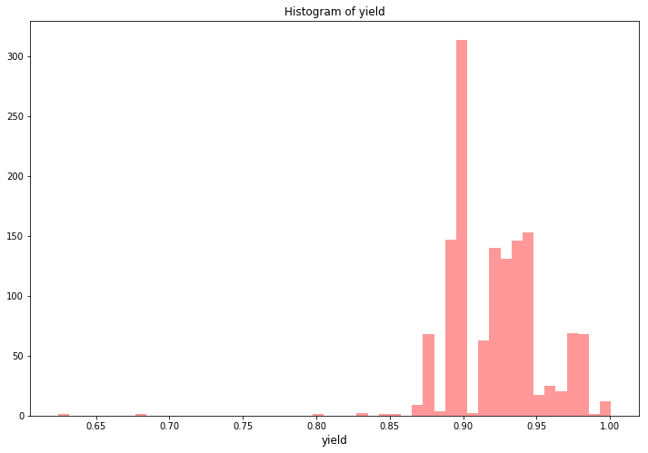

```python
import numpy as np 
import keras
import pandas as pd 
import lightgbm as lgb
import xgboost as xgb
from sklearn.linear_model import BayesianRidge
from sklearn.model_selection import KFold, RepeatedKFold
from sklearn.preprocessing import OneHotEncoder, LabelEncoder
from scipy import sparse
import warnings
import time
import sys
import os
import re
import datetime
import matplotlib.pyplot as plt
import seaborn as sns
import plotly.offline as py
py.init_notebook_mode(connected=True)
import plotly.graph_objs as go
import plotly.tools as tls
from sklearn.metrics import mean_squared_error
from sklearn.metrics import log_loss
warnings.simplefilter(action='ignore', category=FutureWarning)
warnings.filterwarnings("ignore")
pd.set_option('display.max_columns',None)
pd.set_option('max_colwidth',100)
```

    F:\Anaconda3\lib\site-packages\h5py\__init__.py:36: FutureWarning: Conversion of the second argument of issubdtype from `float` to `np.floating` is deprecated. In future, it will be treated as `np.float64 == np.dtype(float).type`.
      from ._conv import register_converters as _register_converters
    Using TensorFlow backend.
    


<script type="text/javascript">window.PlotlyConfig = {MathJaxConfig: 'local'};</script><script type="text/javascript">if (window.MathJax) {MathJax.Hub.Config({SVG: {font: "STIX-Web"}});}</script><script>requirejs.config({paths: { 'plotly': ['https://cdn.plot.ly/plotly-latest.min']},});if(!window._Plotly) {require(['plotly'],function(plotly) {window._Plotly=plotly;});}</script>


```python
train = pd.read_csv('jinnan_round1_train_20181227.csv', encoding = 'gb18030')
test  = pd.read_csv('jinnan_round1_testA_20181227.csv', encoding = 'gb18030')
```

# 数据分析

## 基本数据分析


```python
stats = []
for col in train.columns:
    stats.append((col, train[col].nunique(), train[col].isnull().sum() * 100 / train.shape[0], train[col].value_counts(normalize=True, dropna=False).values[0] * 100, train[col].dtype))
stats_df = pd.DataFrame(stats, columns=['Feature', 'Unique_values', 'Percentage of missing values', 'Percentage of values in the biggest category', 'type'])
stats_df.sort_values('Percentage of missing values', ascending=False)[:10]
```


<div>
<style scoped>
    .dataframe tbody tr th:only-of-type {
        vertical-align: middle;
    }

    .dataframe tbody tr th {
        vertical-align: top;
    }

    .dataframe thead th {
        text-align: right;
    }
</style>
<table border="1" class="dataframe">
  <thead>
    <tr style="text-align: right;">
      <th></th>
      <th>Feature</th>
      <th>Unique_values</th>
      <th>Percentage of missing values</th>
      <th>Percentage of values in the biggest category</th>
      <th>type</th>
    </tr>
  </thead>
  <tbody>
    <tr>
      <th>2</th>
      <td>A2</td>
      <td>1</td>
      <td>96.991404</td>
      <td>96.991404</td>
      <td>float64</td>
    </tr>
    <tr>
      <th>7</th>
      <td>A7</td>
      <td>75</td>
      <td>89.326648</td>
      <td>89.326648</td>
      <td>object</td>
    </tr>
    <tr>
      <th>8</th>
      <td>A8</td>
      <td>8</td>
      <td>89.326648</td>
      <td>89.326648</td>
      <td>float64</td>
    </tr>
    <tr>
      <th>39</th>
      <td>B11</td>
      <td>37</td>
      <td>60.816619</td>
      <td>60.816619</td>
      <td>object</td>
    </tr>
    <tr>
      <th>38</th>
      <td>B10</td>
      <td>180</td>
      <td>17.478510</td>
      <td>17.478510</td>
      <td>object</td>
    </tr>
    <tr>
      <th>3</th>
      <td>A3</td>
      <td>3</td>
      <td>3.008596</td>
      <td>95.702006</td>
      <td>float64</td>
    </tr>
    <tr>
      <th>29</th>
      <td>B1</td>
      <td>21</td>
      <td>0.716332</td>
      <td>53.796562</td>
      <td>float64</td>
    </tr>
    <tr>
      <th>23</th>
      <td>A23</td>
      <td>3</td>
      <td>0.214900</td>
      <td>99.641834</td>
      <td>float64</td>
    </tr>
    <tr>
      <th>21</th>
      <td>A21</td>
      <td>12</td>
      <td>0.214900</td>
      <td>89.828080</td>
      <td>float64</td>
    </tr>
    <tr>
      <th>30</th>
      <td>B2</td>
      <td>3</td>
      <td>0.143266</td>
      <td>98.424069</td>
      <td>float64</td>
    </tr>
  </tbody>
</table>
</div>


## 收率


```python
target_col = "收率"

plt.figure(figsize=(8,6))
plt.scatter(range(train.shape[0]), np.sort(train[target_col].values))
plt.xlabel('index', fontsize=12)
plt.ylabel('yield', fontsize=12)
plt.show()
```


```python
plt.figure(figsize=(12,8))
sns.distplot(train[target_col].values, bins=50, kde=False, color="red")
plt.title("Histogram of yield")
plt.xlabel('yield', fontsize=12)
plt.show()
```





# 特征工程

删除最大类别超过90%或缺失率超过90%的列：


```python
good_cols = list(train.columns)
for col in train.columns:
    rate_biggest_catagory = train[col].value_counts(normalize=True, dropna=False).values[0]
    rate_null = train[col].isnull().sum() / train.shape[0]
    if rate_biggest_catagory > 0.9 or rate_null > 0.9:
        good_cols.remove(col)
```

去除收率异常的行：


```python
train = train[train['收率']>0.87]
```

形成处理后的train和test:


```python
train = train[good_cols]
good_cols.remove('收率')
test = test[good_cols]
```

合并train和test:


```python
recycle_rate = train['收率']
del train['收率']
data = pd.concat([train, test], axis=0, ignore_index=True)
```

处理时间：
- 将单独时间变为数字
- 时间-时间变为时间段


```python
#将单独时间变为数字
def timeToNum(t):
    try:
        h, m, s = t.split(':')
    except:
        if t=='1900/1/9 7:00':
            return 7
        elif t=='1900/1/1 2:30':
            return (2 * 60 + 30) / 60
        else:
            return np.NaN
        
    try:
        tm = (int(h) * 3600 + int(m) * 60 + int(s)) / 3600
    except:
        return np.NaN
    
    return tm   

#将时间-时间变为时间段
def timeToDuration(start_end):
    try:
        start_h, start_m, end_h, end_m = re.findall(r"\d+\.?\d*", start_end)
    except:
        if start_end == np.NaN:
            return np.NaN
    
    try:
        if int(start_h) > int(end_h):  #跨了一天
            td = (int(end_h) * 3600 + int(end_m) * 60 - int(start_h) * 3600 - int(start_m) * 60) / 3600 + 24
        else:
            td = (int(end_h) * 3600 + int(end_m) * 60 - int(start_h) * 3600 - int(start_m) * 60) / 3600
    except:
        if start_end == '19:-20:05':
            return 1
        elif start_end == '15:00-1600':
            return 1
        else:
            return np.NaN
        
    return td
```


```python
for f in ['A5', 'A7', 'A9', 'A11', 'A14', 'A16', 'A24', 'A26', 'B5', 'B7']:
    data[f] = data[f].apply(timeToNum)
```


```python
for f in ['A20', 'A28', 'B4', 'B9', 'B10', 'B11']:
    data[f] = data.apply(lambda df: timeToDuration(df[f]), axis=1)
```


```python
data.head()
```


<div>
<style scoped>
    .dataframe tbody tr th:only-of-type {
        vertical-align: middle;
    }

    .dataframe tbody tr th {
        vertical-align: top;
    }

    .dataframe thead th {
        text-align: right;
    }
</style>
<table border="1" class="dataframe">
  <thead>
    <tr style="text-align: right;">
      <th></th>
      <th>样本id</th>
      <th>A5</th>
      <th>A6</th>
      <th>A7</th>
      <th>A8</th>
      <th>A9</th>
      <th>A10</th>
      <th>A11</th>
      <th>A12</th>
      <th>A14</th>
      <th>A15</th>
      <th>A16</th>
      <th>A17</th>
      <th>A19</th>
      <th>A20</th>
      <th>A21</th>
      <th>A22</th>
      <th>A24</th>
      <th>A25</th>
      <th>A26</th>
      <th>A27</th>
      <th>A28</th>
      <th>B1</th>
      <th>B4</th>
      <th>B5</th>
      <th>B6</th>
      <th>B7</th>
      <th>B8</th>
      <th>B9</th>
      <th>B10</th>
      <th>B11</th>
      <th>B12</th>
      <th>B14</th>
    </tr>
  </thead>
  <tbody>
    <tr>
      <th>0</th>
      <td>sample_1528</td>
      <td>13.5</td>
      <td>38.0</td>
      <td>NaN</td>
      <td>NaN</td>
      <td>15.5</td>
      <td>100</td>
      <td>16.5</td>
      <td>102.0</td>
      <td>17.5</td>
      <td>103.0</td>
      <td>18.5</td>
      <td>104.0</td>
      <td>300</td>
      <td>0.5</td>
      <td>50.0</td>
      <td>9.0</td>
      <td>22.0</td>
      <td>75</td>
      <td>22.5</td>
      <td>70.0</td>
      <td>0.5</td>
      <td>350.0</td>
      <td>1.0</td>
      <td>8.0</td>
      <td>65</td>
      <td>11.5</td>
      <td>45.0</td>
      <td>1.5</td>
      <td>1.5</td>
      <td>NaN</td>
      <td>800.0</td>
      <td>400</td>
    </tr>
    <tr>
      <th>1</th>
      <td>sample_1698</td>
      <td>14.0</td>
      <td>29.0</td>
      <td>NaN</td>
      <td>NaN</td>
      <td>16.0</td>
      <td>101</td>
      <td>17.0</td>
      <td>103.0</td>
      <td>18.0</td>
      <td>104.0</td>
      <td>19.0</td>
      <td>105.0</td>
      <td>200</td>
      <td>1.0</td>
      <td>50.0</td>
      <td>9.0</td>
      <td>20.0</td>
      <td>80</td>
      <td>21.0</td>
      <td>73.0</td>
      <td>1.0</td>
      <td>320.0</td>
      <td>1.0</td>
      <td>23.0</td>
      <td>80</td>
      <td>6.0</td>
      <td>45.0</td>
      <td>1.5</td>
      <td>1.5</td>
      <td>1.0</td>
      <td>1200.0</td>
      <td>400</td>
    </tr>
    <tr>
      <th>2</th>
      <td>sample_639</td>
      <td>14.0</td>
      <td>29.0</td>
      <td>NaN</td>
      <td>NaN</td>
      <td>16.0</td>
      <td>102</td>
      <td>17.0</td>
      <td>103.0</td>
      <td>18.0</td>
      <td>104.0</td>
      <td>19.0</td>
      <td>105.0</td>
      <td>200</td>
      <td>0.5</td>
      <td>50.0</td>
      <td>9.0</td>
      <td>20.0</td>
      <td>79</td>
      <td>21.0</td>
      <td>73.0</td>
      <td>1.0</td>
      <td>320.0</td>
      <td>1.0</td>
      <td>23.0</td>
      <td>80</td>
      <td>1.0</td>
      <td>45.0</td>
      <td>1.5</td>
      <td>1.5</td>
      <td>1.0</td>
      <td>1200.0</td>
      <td>400</td>
    </tr>
    <tr>
      <th>3</th>
      <td>sample_483</td>
      <td>1.5</td>
      <td>38.0</td>
      <td>NaN</td>
      <td>NaN</td>
      <td>3.0</td>
      <td>100</td>
      <td>4.0</td>
      <td>102.0</td>
      <td>5.0</td>
      <td>103.0</td>
      <td>6.0</td>
      <td>104.0</td>
      <td>200</td>
      <td>0.5</td>
      <td>50.0</td>
      <td>10.0</td>
      <td>7.5</td>
      <td>70</td>
      <td>8.0</td>
      <td>78.0</td>
      <td>1.0</td>
      <td>290.0</td>
      <td>1.0</td>
      <td>15.5</td>
      <td>65</td>
      <td>18.0</td>
      <td>45.0</td>
      <td>1.5</td>
      <td>1.5</td>
      <td>NaN</td>
      <td>800.0</td>
      <td>400</td>
    </tr>
    <tr>
      <th>4</th>
      <td>sample_617</td>
      <td>22.0</td>
      <td>29.0</td>
      <td>NaN</td>
      <td>NaN</td>
      <td>0.0</td>
      <td>101</td>
      <td>1.0</td>
      <td>103.0</td>
      <td>2.0</td>
      <td>104.0</td>
      <td>3.0</td>
      <td>105.0</td>
      <td>200</td>
      <td>1.0</td>
      <td>50.0</td>
      <td>9.0</td>
      <td>4.0</td>
      <td>80</td>
      <td>5.0</td>
      <td>73.0</td>
      <td>1.0</td>
      <td>320.0</td>
      <td>1.0</td>
      <td>7.0</td>
      <td>80</td>
      <td>9.0</td>
      <td>45.0</td>
      <td>1.5</td>
      <td>1.5</td>
      <td>1.0</td>
      <td>1200.0</td>
      <td>420</td>
    </tr>
  </tbody>
</table>
</div>


将A25列转化为数值型，特殊字符用NaN填充：


```python
data['A25'] = pd.to_numeric(data['A25'], errors='coerce')
```

NaN用均值填充：


```python
mean_cols = data.mean()
data.fillna(mean_cols, inplace=True)
```


```python
data.isnull().sum().sum()
```


    0


分离训练测试集：


```python
train = data[:train.shape[0]]
test  = data[train.shape[0]:]
```


```python
train.shape, test.shape
```


    ((1381, 33), (150, 33))


去除'样本id'列：


```python
train.drop(['样本id'], axis=1, inplace=True)
samples_id = test.pop('样本id')
```


```python
train.shape
```


    (1381, 32)


转化为array格式：


```python
X_train = train.values
y_train = recycle_rate.values
X_test = test.values
```

# 训练模型


```python
import numpy
import pandas
from keras.models import Sequential
from keras.layers import Dense
from keras.wrappers.scikit_learn import KerasRegressor
from sklearn.model_selection import cross_val_score
from sklearn.model_selection import KFold
from sklearn.preprocessing import StandardScaler
from sklearn.pipeline import Pipeline
```

## 建立基准神经网络模型


```python
# define base model
def baseline_model():
    # create model
    model = Sequential()
    model.add(Dense(32, input_dim=32, kernel_initializer='normal', activation='relu'))
    model.add(Dense(1, kernel_initializer='normal'))
    # Compile model
    model.compile(loss='mean_squared_error', optimizer='adam')
    return model
```


```python
# fix random seed for reproducibility
seed = 7
numpy.random.seed(seed)
# evaluate model with standardized dataset
estimator = KerasRegressor(build_fn=baseline_model, nb_epoch=100, batch_size=5, verbose=0)
```


```python
kfold = KFold(n_splits=10, random_state=seed)
results = cross_val_score(estimator, X_train, y_train, cv=kfold)
print("Results: %.2f (%.2f) MSE" % (results.mean(), results.std()))
```

    Results: -0.07 (0.07) MSE
    

### 标准化数据集


```python
# evaluate model with standardized dataset
numpy.random.seed(seed)
estimators = []
estimators.append(('standardize', StandardScaler()))
estimators.append(('mlp', KerasRegressor(build_fn=baseline_model, epochs=50, batch_size=5,verbose=0)))
pipeline = Pipeline(estimators)
kfold = KFold(n_splits=10, random_state=seed)
results = cross_val_score(pipeline, X_train, y_train, cv=kfold, scoring='neg_mean_squared_error')
print("Standardized: %.8f (%.8f) MSE" % (results.mean(), results.std()))
```

    Standardized: -0.00457211 (0.00693551) MSE
    

## 评估层数更深的网络拓扑


```python
# define the model
def larger_model():
    # create model
    model = Sequential()
    model.add(Dense(32, input_dim=32, kernel_initializer='normal', activation='relu'))
    model.add(Dense(16, kernel_initializer='normal', activation='relu'))
    model.add(Dense(1, kernel_initializer='normal'))
    # Compile model
    model.compile(loss='mean_squared_error', optimizer='adam')
    return model
```


```python
numpy.random.seed(seed)
estimators = []
estimators.append(('standardize', StandardScaler()))
estimators.append(('mlp', KerasRegressor(build_fn=larger_model, epochs=50, batch_size=5,verbose=0)))
pipeline = Pipeline(estimators)
kfold = KFold(n_splits=10, random_state=seed)
results = cross_val_score(pipeline, X_train, y_train, cv=kfold, scoring='neg_mean_squared_error')
print("Larger: %.8f (%.8f) MSE" % (results.mean(), results.std()))
```

    Larger: -0.00132873 (0.00160217) MSE
    

## 评估层宽更宽的网络拓扑


```python
# define wider model
def wider_model():
# create model
    model = Sequential()
    model.add(Dense(53, input_dim=32, kernel_initializer='normal', activation='relu'))
    model.add(Dense(1, kernel_initializer='normal'))
    # Compile model
    model.compile(loss='mean_squared_error', optimizer='adam')
    return model
```


```python
numpy.random.seed(seed)
estimators = []
estimators.append(('standardize', StandardScaler()))
estimators.append(('mlp', KerasRegressor(build_fn=wider_model, epochs=100, batch_size=5,verbose=0)))
pipeline = Pipeline(estimators)
kfold = KFold(n_splits=10, random_state=seed)
results = cross_val_score(pipeline, X_train, y_train, cv=kfold, scoring = 'neg_mean_squared_error')
print("Wider: %.8f (%.8f) MSE" % (results.mean(), results.std()))
```

    Wider: -0.00071118 (0.00071121) MSE
    

## 选择合适的网络结构


```python
# define suitable model
def wider_model():
# create model
    model = Sequential()
    model.add(Dense(53, input_dim=32, kernel_initializer='normal', activation='relu'))
    #keras.layers.Dropout(0.5)
    keras.layers.BatchNormalization
    model.add(Dense(14, kernel_initializer='normal', activation='relu'))
    #keras.layers.Dropout(0.5)
    keras.layers.BatchNormalization
    model.add(Dense(12, kernel_initializer='normal', activation='relu'))
    #keras.layers.Dropout(0.5)
    keras.layers.BatchNormalization
    model.add(Dense(10, kernel_initializer='normal', activation='relu'))
    #keras.layers.Dropout(0.3)
    keras.layers.BatchNormalization
    model.add(Dense(1, kernel_initializer='normal'))
    # Compile model
    model.compile(loss='mean_squared_error', optimizer='adam')
    return model
```


```python
numpy.random.seed(seed)
estimators = []
estimators.append(('standardize', StandardScaler()))
estimators.append(('mlp', KerasRegressor(build_fn=wider_model, epochs=100, batch_size=5,verbose=0)))
pipeline = Pipeline(estimators)
kfold = KFold(n_splits=10, random_state=seed)
results = cross_val_score(pipeline, X_train, y_train, cv=kfold, scoring = 'neg_mean_squared_error')
print("Wider: %.8f (%.8f) MSE" % (results.mean(), results.std()))
```

    Wider: -0.00033929 (0.00013363) MSE
    


```python
from sklearn.metrics import mean_squared_error

pipeline.fit(X_train, y_train)
y_train_predictions = pipeline.predict(X_train)
print("MSE in train set: %.8f" % mean_squared_error(y_train, y_train_predictions))
```

    MSE in train set: 0.00014202
    

# 写入文件


```python
Y_test = pd.DataFrame(data={'样本Id':samples_id, '收率':predictions})
Y_test['收率'] = Y_test['收率'].apply(lambda x: round(x, 3))
```


    ---------------------------------------------------------------------------

    NameError                                 Traceback (most recent call last)

    <ipython-input-34-6d923f6df54a> in <module>()
    ----> 1 Y_test = pd.DataFrame(data={'样本Id':samples_id, '收率':predictions})
          2 Y_test['收率'] = Y_test['收率'].apply(lambda x: round(x, 3))
    

    NameError: name 'predictions' is not defined


```python
#Y_test.to_csv("Result_8.csv", index=False, header=False)
```
